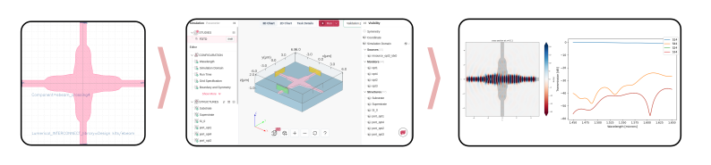

# gds_tidy3d
Minimal Python module to assist in setting up Tidy3D FDTD simulation on planar nanophotonic devices.

## Functions
- Generate tidy3d simulation of a gds device systematically.
- Generate tidy3d simulations from GDS device by identifying ports and simulation region from an input technology stack.
- Generate S-parameters of devices and export them to standard formats.
